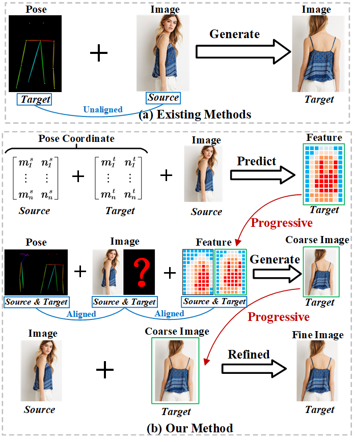
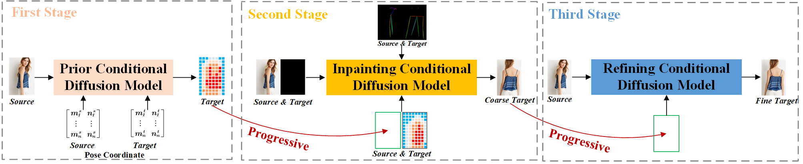

# PCDMs
 Implementation code：[Advancing Pose-Guided Image Synthesis with Progressive Conditional Diffusion Models](https://ieeexplore.ieee.org/stamp/stamp.jsp?tp=&arnumber=9457192)

## Generated Results

You can directly download our test results from Google Drive: (1) [PCDMs vs SOTA](https://drive.google.com/drive/folders/1q21tA3VsQqScecQ7m3_eUFxIPWUGYKAa?usp=drive_link) (2) [PCDMs Results](https://drive.google.com/drive/folders/1sjqMhZ79pugk2IHhW-whg_NASpx3BSew?usp=drive_link).

The [PCDMs vs SOTA](https://drive.google.com/drive/folders/1q21tA3VsQqScecQ7m3_eUFxIPWUGYKAa?usp=drive_link) compares our method with several state-of-the-art methods e.g. ADGAN, PISE, GFLA, DPTN, CASD, NTED, PIDM. 
Each row contains target_pose, source_image, ground_truth, ADGAN, PISE, GFLA, DPTN, CASD, NTED, PIDM, and PCDMs (ours) respectively.

## Methods

## Checkpoints Links
We provide 3 stage checkpoints available [here](https://drive.google.com/drive/folders/1xDpSIBdP11UoXe0HoWGPWBfEnk1zRMVw?usp=drive_link).

## TO DO
Released the train and test code.

